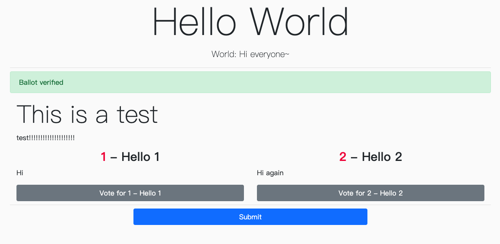

# Crypto-Vote
This is a demonstration of how Blind Signature can be used in the scenario of E-Voting.  
Read the reference or [my presentation at INFAS 2017](https://www.slideshare.net/s3131212/ss-76836570) for more information on how the schema works.

# Screenshot



## Installation
### Production
First clone the repo:  
```
git clone https://github.com/s3131212/Crypto-Vote.git
cd Crypto-Vote
```

Then build the frontend:
```
cd client  # pwd = /path/to/repo/client
npm install
npm run build
``` 

Edit the database connection info:
```
cd ../server  # pwd = /path/to/repo/server
vim index.js
```
Make sure you have already import `db.sql`

Last, start the server:  
```
npm install
npm start
```
When no port is set in environment variable, port `5000` will be used.

### Development
Start both backend server and React dev server.

To start backend server, use:
```
# pwd = /path/to/repo/server
npm start
```

Before starting React dev server, change the `proxy` in `package.json` to backend server address.

Then start the React dev server:
```
cd ../client  # pwd = /path/to/repo/client
npm start
```

Now use `localhost:3000` (or the port React dev server used) to access Crypto-Vote.  

## References
### Paper
J. Radwin, Michael & Phil Klein, Professor. (1997). An Untraceable, Universally Verifiable Voting Scheme.  
蘇品長(Pin-Chang Su);葉昱宗(Yui-Chong Yeh)(2017)。新型態之電子投票機制設計。電子商務學報。19(1)。29-50。

### Code
[Deploying a React app with React-Router and an Express Backend](https://dev.to/nburgess/creating-a-react-app-with-react-router-and-an-express-backend-33l3)

# LICENSE
MIT